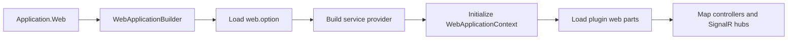

# Zongsoft.Plugins.Web Web Plugin Library


[English](README.md) |
[简体中文](README.zh-Hans.md)

-----

## Overview

[**Z**ongsoft.**P**lugins.**W**eb](https://github.com/Zongsoft/framework/tree/main/Zongsoft.Plugins.Web) connects the [Zongsoft plugin runtime](../Zongsoft.Plugins/README.md) to [ASP.NET Core](https://learn.microsoft.com/aspnet/core/). It creates a web host, initializes the plugin tree, discovers controllers and SignalR hubs contributed by plugins, and establishes a request-aware application context.

Use this package when a web application is assembled from Zongsoft plugins. Use [Zongsoft.Web](../Zongsoft.Web/README.md) directly when only its MVC, binding, formatting, authentication, or file-access helpers are required.

## How the Host Is Composed



The package deliberately owns this ordering. Plugin components must be available before MVC endpoints are mapped, while request-bound values such as `HttpContext`, the principal, and the session are resolved only while a request is active.

## Installation

```shell
dotnet add package Zongsoft.Plugins.Web
```

The package brings in `Zongsoft.Core`, `Zongsoft.Plugins`, and `Zongsoft.Web`. A deployable application normally also contains its plugin manifests and option files in the application directory.

## Quick Start

```csharp
using Zongsoft.Web;

var application = Application.Web(args, builder =>
{
	builder.Services.AddHttpContextAccessor();
});

await application.RunAsync();
```

`Application.Web` loads `web.option`, builds the plugin-aware service provider, initializes `WebApplicationContext`, installs the framework middleware pipeline, maps controllers, and maps discovered SignalR hubs. Use the overload with a name when the host must select a named application profile.

> 💡 Keep application-specific service registration in the builder callback. Put reusable components and their relationships in plugin manifests so other hosts can compose them in the same way.

## Controller and Hub Discovery

The `ApplicationConvention` integrates plugin components with MVC application models. Controllers contributed by loaded plugin assemblies are activated through the framework service container. SignalR hub types are collected as application features and mapped during host startup.

The built-in `PluginController` exposes plugin information for framework tooling. Treat that endpoint as operational metadata and protect it according to the deployment's authorization policy.

## Complete Example: Deploy a Decoupled Web Plugin

This example uses the existing [Zongsoft web host](https://github.com/Zongsoft/hosting/tree/main/web/default) without changing it. The business plugin depends only on Core's expression contract and ASP.NET Core. Scriban is a deployment-time implementation choice, not a business-project reference.

### 1. Create the Consumer Plugin

Create an `Acme.Rules.Web` class library targeting a framework compatible with the host, enable implicit usings, and reference `Zongsoft.Core` plus the `Microsoft.AspNetCore.App` FrameworkReference. Only the host itself needs Plugins.Web. Add this controller:

```csharp
using Microsoft.AspNetCore.Mvc;
using Microsoft.AspNetCore.Authorization;
using Zongsoft.Expressions;
using Zongsoft.Services;

namespace Acme.Rules.Web;

[ApiController]
[AllowAnonymous]
[Route("rules/probe")]
public class ProbeController : ControllerBase
{
	[HttpGet]
	public IActionResult Get()
	{
		var context = ApplicationContext.Current;
		var evaluator = context.Services.FindRequired<IExpressionEvaluator>(
			context.Configuration["Rules:Evaluator"]);
		var value = evaluator.Evaluate("x + y", new Dictionary<string, object>
		{
			["x"] = 20,
			["y"] = 22,
		});
		return this.Ok(new { Value = value });
	}
}
```

It evaluates a fixed expression, not client-supplied scripts. Module-owned controllers can use the application's `Module.Current.Services` or property injection; see [Core service resolution](../Zongsoft.Core/README.md). Do not construct, cache or dispose a concrete evaluator inside the controller.

### 2. Deploy the Manifest and Configuration

Deploy the built `Acme.Rules.Web.dll` and the following two matching files to `plugins/acme/rules/web/`. The assembly name must match the actual project output.

`Acme.Rules.Web.plugin`:

```xml
<?xml version="1.0" encoding="utf-8"?>
<plugin name="Acme.Rules.Web">
	<manifest>
		<assemblies>
			<assembly name="Acme.Rules.Web" />
		</assemblies>
		<dependencies>
			<dependency name="Main" />
		</dependencies>
	</manifest>
</plugin>
```

`Acme.Rules.Web.option`:

```xml
<?xml version="1.0" encoding="utf-8"?>
<options>
	<option path="/">
		<rules evaluator="Scriban" />
	</option>
</options>
```

Add the [Scriban](../externals/scriban/README.md) fragment to the host's existing `.deploy`:

```ini
[plugins zongsoft externals scriban]
nuget:Zongsoft.Externals.Scriban
```

Retain Main, host dependencies and runtime resources. The business manifest need not depend on Scriban's plugin name: configuration and the shared contract select the implementation, while deployment composition ensures its availability. See the [plugin guide](../Zongsoft.Plugins/README.md) for deployment commands and directory layout.

### 3. Send a Request and Verify

Start the host from the isolated deployment directory, binding only to loopback. The example port must be available:

```shell
dotnet Zongsoft.Hosting.Web.dll --urls=http://127.0.0.1:51873
curl http://127.0.0.1:51873/rules/probe
```

Expect `200 OK` with `Value` equal to `42` in the JSON response. Press Ctrl+C to stop the host afterward. Isolated local verification covered assembly discovery, attribute routing, configuration reading, shared-interface matching and the HTTP response. It used no database, Redis or external model service.

🚨 `[AllowAnonymous]` is only for this input-free local probe, not an authorization template for business APIs. Real endpoints need authentication, authorization, input limits and an environment-appropriate CORS policy.

### Common Pitfalls

- Copied files but no controller: check manifest assembly entries, loadable dependencies and actual ASP.NET Core assembly references. A DLL placed in a directory is not automatically a plugin Web part.
- Discovered controller but HTTP 404: `Area` and `HttpGet` alone do not guarantee a route template. The default host uses `MapControllers()`, requiring attribute routes or explicitly configured application conventions.
- Provider not found on the first request: inspect the option filename, actual `Rules:Evaluator` value, provider assembly and service scanning. A package reference does not deploy an implementation plugin.
- Do not hide composition problems by moving business controllers or all implementation registrations into the host's `Program.cs`.

## Request Context

`WebApplicationContext` extends `PluginApplicationContext` with web-specific state:

- the current `HttpContext` and authenticated principal;
- the framework session abstraction;
- configured web sites and host mappings;
- initialization of web parts contributed by loaded plugins.

🚨 Do not retain request-scoped objects in singleton plugin components. `HttpContext`, principals, sessions, and scoped services are only valid for the active request and may be accessed concurrently by different requests.

## Startup and Extension Points

The generated pipeline enables CORS, localization, method override, routing, authentication, authorization, response compression, static files, controllers, and SignalR. `IApplicationInitializer<IApplicationBuilder>` implementations run before the standard middleware is added and are the supported hook for reusable startup behavior.

If middleware order is security-sensitive, inspect [Application.cs](src/Application.cs) before adding an initializer: authentication and authorization depend on routing, and endpoint mapping occurs after the standard middleware chain.

## Related Resources

- [Plugin runtime and manifest model](../Zongsoft.Plugins/README.md)
- [Web library](../Zongsoft.Web/README.md)
- [ASP.NET Core middleware](https://learn.microsoft.com/aspnet/core/fundamentals/middleware/)
- [Implementation guidance](../Zongsoft.Plugins/SKILL.md)
