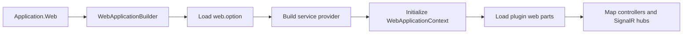

# Zongsoft.Plugins.Web Web Plugin Library


[English](README.md) |
[简体中文](README.zh-Hans.md)

-----

## Overview

[**Z**ongsoft.**P**lugins.**W**eb](https://github.com/Zongsoft/framework/tree/main/Zongsoft.Plugins.Web) connects the [Zongsoft plugin runtime](../Zongsoft.Plugins/README.md) to [ASP.NET Core](https://learn.microsoft.com/aspnet/core/). It creates a web host, initializes the plugin tree, discovers controllers and SignalR hubs contributed by plugins, and establishes a request-aware application context.

Use this package when a web application is assembled from Zongsoft plugins. Use [Zongsoft.Web](../Zongsoft.Web/README.md) directly when only its MVC, binding, formatting, authentication, or file-access helpers are required.

## How the Host Is Composed



The package deliberately owns this ordering. Plugin components must be available before MVC endpoints are mapped, while request-bound values such as `HttpContext`, the principal, and the session are resolved only while a request is active.

## Installation

```shell
dotnet add package Zongsoft.Plugins.Web
```

The package brings in `Zongsoft.Core`, `Zongsoft.Plugins`, and `Zongsoft.Web`. A deployable application normally also contains its plugin manifests and option files in the application directory.

## Quick Start

```csharp
using Zongsoft.Web;

var application = Application.Web(args, builder =>
{
	builder.Services.AddHttpContextAccessor();
});

await application.RunAsync();
```

`Application.Web` loads `web.option`, builds the plugin-aware service provider, initializes `WebApplicationContext`, installs the framework middleware pipeline, maps controllers, and maps discovered SignalR hubs. Use the overload with a name when the host must select a named application profile.

> 💡 Keep application-specific service registration in the builder callback. Put reusable components and their relationships in plugin manifests so other hosts can compose them in the same way.

## Controller and Hub Discovery

The `ApplicationConvention` integrates plugin components with MVC application models. Controllers contributed by loaded plugin assemblies are activated through the framework service container. SignalR hub types are collected as application features and mapped during host startup.

The built-in `PluginController` exposes plugin information for framework tooling. Treat that endpoint as operational metadata and protect it according to the deployment's authorization policy.

## Real Use Case: The Discussions Web Plugin

### 1. Understand the Existing Controller's Consumption Boundary

[ForumController](../../discussions/src/api/Controllers/ForumController.cs) belongs to the real [Web class library](../../discussions/src/api/Zongsoft.Discussions.Web.csproj) and inherits the framework's service controller. This excerpt preserves one actual action and omits the others:

```csharp
[ControllerName("Forums")]
public class ForumController : ServiceController<Forum, ForumService>
{
	[ActionName("Moderators")]
	[HttpGet("{id}/[action]")]
	public IEnumerable<UserProfile> GetModerators(ushort id)
	{
		return this.DataService.GetModerators(id, this.Request.Headers.GetDataSchema());
	}
}
```

`Forum`, `UserProfile` and `ForumService` come from Discussions rather than types invented for this guide. The controller consumes its domain service through the base `DataService` property and passes the request schema. It constructs no data engine, database driver or cache implementation. See [ForumService.cs](../../discussions/src/Services/ForumService.cs).

### 2. Use Real Manifests and Deployment Artifacts

The manifest excerpt from [Zongsoft.Discussions.Web.plugin](../../discussions/src/api/Zongsoft.Discussions.Web.plugin):

```xml
<manifest>
	<dependencies>
		<dependency name="Zongsoft.Discussions" />
	</dependencies>
	<assemblies>
		<assembly name="Zongsoft.Discussions.Web" />
	</assemblies>
</manifest>
```

Use the [domain deployment manifest](../../discussions/src/Zongsoft.Discussions.deploy) and [Web deployment manifest](../../discussions/src/api/Zongsoft.Discussions.Web.deploy), preserving business options, mappings, identity extensions and templates. This package-composition fragment still requires the host, Data, Security, a database driver and file storage from the complete deployment plan:

```ini
[plugins zongsoft discussions]
nuget:Zongsoft.Discussions

[plugins zongsoft discussions web]
nuget:Zongsoft.Discussions.Web
```

The Web manifest depends on the domain plugin, whose project targets its public dependencies. Configuration and plugins locate data providers. See the [plugin guide](../Zongsoft.Plugins/README.md) for module composition.

### 3. Check Actual Requests and Prerequisites

[forum.http](../../discussions/docs/http/forum.http) contains maintained forum request templates, including the list route `/Discussions/Forums`. The moderator action appends `{id}/Moderators` to the base route; confirm the complete route through host controller descriptors.

Prepare a compatible host, dedicated initialized database, `Discussions` connection, test site, appropriate identity and required storage. Use forum identifiers from your test data rather than assuming a fixed ID exists. This is a source-backed use case, not a database-free probe or a promise of success in an uninitialized environment.

🚨 Do not remove identity transformation, data validators or business permissions to make an example succeed. Even read requests may expose forum data. Use an isolated identity/site and never copy repository addresses or credentials into real requests.

### Common Pitfalls

- DLL copied but controller absent: check manifest assembly entries, dependencies and the Web library's actual ASP.NET Core references.
- Controller discovered but HTTP 404: check `ControllerName`, module ownership, base routes and action templates; class names alone do not determine URLs.
- Service or data unavailable on first call: inspect service scanning, modules, connections, mappings and the database rather than hard-coding implementations into host startup.
- Subscription, worker and data-resource shutdown follow host lifecycle; stop the test host before cleaning only its test resources.

## Request Context

`WebApplicationContext` extends `PluginApplicationContext` with web-specific state:

- the current `HttpContext` and authenticated principal;
- the framework session abstraction;
- configured web sites and host mappings;
- initialization of web parts contributed by loaded plugins.

🚨 Do not retain request-scoped objects in singleton plugin components. `HttpContext`, principals, sessions, and scoped services are only valid for the active request and may be accessed concurrently by different requests.

## Startup and Extension Points

The generated pipeline enables CORS, localization, method override, routing, authentication, authorization, response compression, static files, controllers, and SignalR. `IApplicationInitializer<IApplicationBuilder>` implementations run before the standard middleware is added and are the supported hook for reusable startup behavior.

If middleware order is security-sensitive, inspect [Application.cs](src/Application.cs) before adding an initializer: authentication and authorization depend on routing, and endpoint mapping occurs after the standard middleware chain.

## Related Resources

- [Plugin runtime and manifest model](../Zongsoft.Plugins/README.md)
- [Web library](../Zongsoft.Web/README.md)
- [ASP.NET Core middleware](https://learn.microsoft.com/aspnet/core/fundamentals/middleware/)
- [Implementation guidance](../Zongsoft.Plugins/SKILL.md)
