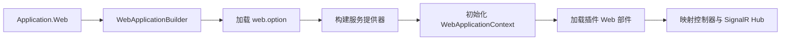

# Zongsoft.Plugins.Web Web插件库


[English](README.md) |
[简体中文](README.zh-Hans.md)

-----

## 概述

[**Z**ongsoft.**P**lugins.**W**eb](https://github.com/Zongsoft/framework/tree/main/Zongsoft.Plugins.Web) 将 [Zongsoft 插件运行时](../Zongsoft.Plugins/README.zh-Hans.md)接入 [ASP.NET Core](https://learn.microsoft.com/zh-cn/aspnet/core/)。它负责创建 Web 宿主、初始化插件树、发现插件提供的控制器与 SignalR Hub，并建立能够感知当前请求的应用上下文。

当 Web 应用由 Zongsoft 插件装配时使用本包；若只需要 MVC、绑定、格式化、身份验证或文件访问辅助能力，请直接使用 [Zongsoft.Web](../Zongsoft.Web/README.zh-Hans.md)。

## 宿主如何组成



本包有意固定上述顺序：映射 MVC 端点前必须先得到插件组件；`HttpContext`、当前主体和会话等请求值则只能在有效请求期间解析。

## 安装

```shell
dotnet add package Zongsoft.Plugins.Web
```

该包会引入 `Zongsoft.Core`、`Zongsoft.Plugins` 和 `Zongsoft.Web`。可部署应用通常还要在应用目录中放置插件清单与选项文件。

## 快速开始

```csharp
using Zongsoft.Web;

var application = Application.Web(args, builder =>
{
	builder.Services.AddHttpContextAccessor();
});

await application.RunAsync();
```

`Application.Web` 会加载 `web.option`、构建插件感知的服务提供器、初始化 `WebApplicationContext`、安装框架中间件管线，并映射控制器与已发现的 SignalR Hub。需要选择具名应用配置时，使用带名称的重载。

> 💡 应用专属的服务注册可放在构建器回调中；可复用组件及其关系宜写入插件清单，使其他宿主也能以相同方式装配。

## 控制器与 Hub 发现

`ApplicationConvention` 将插件组件接入 MVC 应用模型。已加载插件程序集中的控制器由框架服务容器激活；SignalR Hub 类型作为应用特性收集，并在宿主启动期间映射。

内置 `PluginController` 为框架工具提供插件信息。该端点属于运行元数据，应按部署环境的授权策略加以保护。

## 真实用例：Discussions Web 插件

### 1. 从现有控制器理解消费边界

[ForumController](../../discussions/src/api/Controllers/ForumController.cs) 位于真实的 [Web 类库](../../discussions/src/api/Zongsoft.Discussions.Web.csproj)，继承框架服务控制器。下面保留该类的一个实际动作，其余动作省略：

```csharp
[ControllerName("Forums")]
public class ForumController : ServiceController<Forum, ForumService>
{
	[ActionName("Moderators")]
	[HttpGet("{id}/[action]")]
	public IEnumerable<UserProfile> GetModerators(ushort id)
	{
		return this.DataService.GetModerators(id, this.Request.Headers.GetDataSchema());
	}
}
```

`Forum`、`UserProfile` 和 `ForumService` 都来自 Discussions，而不是本文新造的类型。控制器通过基类的 `DataService` 消费领域服务，传递请求数据模式，不构造数据引擎、数据库驱动或缓存实现。服务实现见 [ForumService.cs](../../discussions/src/Services/ForumService.cs)。

### 2. 使用真实清单与部署产物

[Zongsoft.Discussions.Web.plugin](../../discussions/src/api/Zongsoft.Discussions.Web.plugin) 的 manifest 摘录：

```xml
<manifest>
	<dependencies>
		<dependency name="Zongsoft.Discussions" />
	</dependencies>
	<assemblies>
		<assembly name="Zongsoft.Discussions.Web" />
	</assemblies>
</manifest>
```

部署使用[领域清单](../../discussions/src/Zongsoft.Discussions.deploy)和 [Web 清单](../../discussions/src/api/Zongsoft.Discussions.Web.deploy)，保留业务 `.option`、`.mapping`、身份扩展和模板。包组合片段如下，宿主自身及 Data、Security、数据库驱动、文件存储仍需按完整方案部署：

```ini
[plugins zongsoft discussions]
nuget:Zongsoft.Discussions

[plugins zongsoft discussions web]
nuget:Zongsoft.Discussions.Web
```

Web 清单依赖领域插件，领域项目只面向其公共依赖；数据提供者由配置与插件体系定位。详细模块装配见[插件框架](../Zongsoft.Plugins/README.zh-Hans.md)。

### 3. 核对真实请求与前置条件

[forum.http](../../discussions/docs/http/forum.http) 提供已维护的论坛请求模板；其中的列表路由为 `/Discussions/Forums`。版主动作在基类路由上增加 `{id}/Moderators`，实际完整路由以宿主控制器描述符为准。

运行前准备兼容宿主、专用数据库与初始化结构、`Discussions` 连接、测试站点、相应身份及需要的存储。使用当前测试数据中的论坛标识，不假设固定编号存在。本节是源码引用用例，不是无需数据库的探针，也不保证未初始化环境返回成功。

🚨 不能为“跑通示例”移除身份转换、数据验证器或业务权限。只读请求也可能暴露论坛数据，应使用隔离身份和站点，避免将仓库中的地址或凭据直接用于实际请求。

### 常见误区

- DLL 已复制但控制器未发现：核对 manifest 的程序集条目和依赖、Web 类库实际引用的 ASP.NET Core 组件。
- 控制器已发现但 URL 返回 404：核对 `ControllerName`、模块归属、基类路由与动作模板；只看类名不足以确定 URL。
- 首次调用找不到服务或数据：检查服务扫描、模块、连接、映射及数据库，不要把这些实现硬编码到宿主入口。
- 取消订阅、关闭工作器和数据资源按宿主生命周期处理；停止测试宿主后仅清理本次测试资源。

## 请求上下文

`WebApplicationContext` 在 `PluginApplicationContext` 基础上增加了 Web 状态：

- 当前 `HttpContext` 与已验证主体；
- 框架会话抽象；
- 已配置的网站和主机映射；
- 已加载插件贡献的 Web 部件初始化。

🚨 不要在单例插件组件中保存请求作用域对象。`HttpContext`、主体、会话和作用域服务只在当前请求内有效，不同请求也可能并发执行。

## 启动流程与扩展点

生成的管线会启用 CORS、本地化、方法覆盖、路由、身份验证、授权、响应压缩、静态文件、控制器和 SignalR。`IApplicationInitializer<IApplicationBuilder>` 实现在标准中间件加入前执行，是复用启动行为的扩展入口。

如果中间件顺序涉及安全，请在增加初始化器前检查 [Application.cs](src/Application.cs)：身份验证与授权依赖路由，端点映射发生在标准中间件链之后。

## 延伸阅读

- [插件运行时与清单模型](../Zongsoft.Plugins/README.zh-Hans.md)
- [Web 类库](../Zongsoft.Web/README.zh-Hans.md)
- [ASP.NET Core 中间件](https://learn.microsoft.com/zh-cn/aspnet/core/fundamentals/middleware/)
- [实现协作指南](../Zongsoft.Plugins/SKILL.md)
