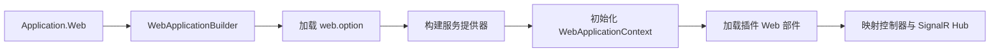

# Zongsoft.Plugins.Web Web插件库


[English](README.md) |
[简体中文](README.zh-Hans.md)

-----

## 概述

[**Z**ongsoft.**P**lugins.**W**eb](https://github.com/Zongsoft/framework/tree/main/Zongsoft.Plugins.Web) 将 [Zongsoft 插件运行时](../Zongsoft.Plugins/README.zh-Hans.md)接入 [ASP.NET Core](https://learn.microsoft.com/zh-cn/aspnet/core/)。它负责创建 Web 宿主、初始化插件树、发现插件提供的控制器与 SignalR Hub，并建立能够感知当前请求的应用上下文。

当 Web 应用由 Zongsoft 插件装配时使用本包；若只需要 MVC、绑定、格式化、身份验证或文件访问辅助能力，请直接使用 [Zongsoft.Web](../Zongsoft.Web/README.zh-Hans.md)。

## 宿主如何组成



本包有意固定上述顺序：映射 MVC 端点前必须先得到插件组件；`HttpContext`、当前主体和会话等请求值则只能在有效请求期间解析。

## 安装

```shell
dotnet add package Zongsoft.Plugins.Web
```

该包会引入 `Zongsoft.Core`、`Zongsoft.Plugins` 和 `Zongsoft.Web`。可部署应用通常还要在应用目录中放置插件清单与选项文件。

## 快速开始

```csharp
using Zongsoft.Web;

var application = Application.Web(args, builder =>
{
	builder.Services.AddHttpContextAccessor();
});

await application.RunAsync();
```

`Application.Web` 会加载 `web.option`、构建插件感知的服务提供器、初始化 `WebApplicationContext`、安装框架中间件管线，并映射控制器与已发现的 SignalR Hub。需要选择具名应用配置时，使用带名称的重载。

> 💡 应用专属的服务注册可放在构建器回调中；可复用组件及其关系宜写入插件清单，使其他宿主也能以相同方式装配。

## 控制器与 Hub 发现

`ApplicationConvention` 将插件组件接入 MVC 应用模型。已加载插件程序集中的控制器由框架服务容器激活；SignalR Hub 类型作为应用特性收集，并在宿主启动期间映射。

内置 `PluginController` 为框架工具提供插件信息。该端点属于运行元数据，应按部署环境的授权策略加以保护。

## 完整示例：部署一个解耦的 Web 插件

以下使用已有的 [Zongsoft Web 宿主](https://github.com/Zongsoft/hosting/tree/main/web/default)，宿主保持原样。业务插件只依赖 Core 的表达式接口与 ASP.NET Core；Scriban 是部署时选用的实现，不是业务项目引用。

### 1. 创建消费插件

创建 `Acme.Rules.Web` 类库，选择与宿主匹配的目标框架，启用隐式 using，并引用 `Zongsoft.Core` 与 `Microsoft.AspNetCore.App` FrameworkReference。宿主自身才需要引用 Plugins.Web。控制器如下：

```csharp
using Microsoft.AspNetCore.Mvc;
using Microsoft.AspNetCore.Authorization;
using Zongsoft.Expressions;
using Zongsoft.Services;

namespace Acme.Rules.Web;

[ApiController]
[AllowAnonymous]
[Route("rules/probe")]
public class ProbeController : ControllerBase
{
	[HttpGet]
	public IActionResult Get()
	{
		var context = ApplicationContext.Current;
		var evaluator = context.Services.FindRequired<IExpressionEvaluator>(
			context.Configuration["Rules:Evaluator"]);
		var value = evaluator.Evaluate("x + y", new Dictionary<string, object>
		{
			["x"] = 20,
			["y"] = 22,
		});
		return this.Ok(new { Value = value });
	}
}
```

这里只计算固定表达式，不接受客户端脚本。模块所属控制器可使用应用定义的 `Module.Current.Services` 或属性注入；详见 [Core 服务定位](../Zongsoft.Core/README.zh-Hans.md)。不要在控制器内创建、缓存或释放具体求值器。

### 2. 部署清单和配置

将编译后的 `Acme.Rules.Web.dll` 与下列两个同名配置产物一起部署到 `plugins/acme/rules/web/`。程序集名称需要与项目实际输出一致。

`Acme.Rules.Web.plugin`：

```xml
<?xml version="1.0" encoding="utf-8"?>
<plugin name="Acme.Rules.Web">
	<manifest>
		<assemblies>
			<assembly name="Acme.Rules.Web" />
		</assemblies>
		<dependencies>
			<dependency name="Main" />
		</dependencies>
	</manifest>
</plugin>
```

`Acme.Rules.Web.option`：

```xml
<?xml version="1.0" encoding="utf-8"?>
<options>
	<option path="/">
		<rules evaluator="Scriban" />
	</option>
</options>
```

在宿主已有 `.deploy` 中加入 [Scriban](../externals/scriban/README.zh-Hans.md) 部署片段：

```ini
[plugins zongsoft externals scriban]
nuget:Zongsoft.Externals.Scriban
```

保留 Main 清单、宿主依赖和运行时资源。业务清单不必依赖 Scriban 的插件名；配置与公共接口约定负责选择实现，部署组成负责保证它存在。部署工具命令及目录布局见[插件入门](../Zongsoft.Plugins/README.zh-Hans.md)。

### 3. 发起请求并验证

从隔离部署目录启动宿主，只绑定本机回环地址；示例端口需未被占用：

```shell
dotnet Zongsoft.Hosting.Web.dll --urls=http://127.0.0.1:51873
curl http://127.0.0.1:51873/rules/probe
```

预期为 `200 OK`，JSON 中的 `Value` 为 `42`。检查完毕后按 Ctrl+C 停止宿主。隔离本地验证已覆盖“插件程序集发现 → 属性路由 → 配置读取 → 公共接口匹配 → HTTP 返回”；没有使用数据库、Redis 或外部模型服务。

🚨 `[AllowAnonymous]` 仅用于这个不接受输入的本地探针，不是业务 API 的授权模板。实际端点应配置身份验证、授权、输入限制和适合部署环境的 CORS 策略。

### 常见误区

- 文件已复制但控制器不存在：核对插件 manifest 的程序集条目、依赖能否加载，以及程序集是否实际引用 ASP.NET Core。仅将 DLL 放进目录不会自动成为插件 Web 部件。
- 控制器已发现但 URL 返回 404：`Area`、`HttpGet` 本身不保证存在路由模板。默认宿主使用 `MapControllers()`，需要显式属性路由或应用配置的路由约定。
- 首次请求找不到提供者：检查选项文件名称、`Rules:Evaluator` 实际值、提供者程序集与服务扫描；包引用不会自动代替实现插件的部署。
- 不要通过把业务控制器或实现类注册全部搬进宿主 `Program.cs` 来掩盖装配问题。

## 请求上下文

`WebApplicationContext` 在 `PluginApplicationContext` 基础上增加了 Web 状态：

- 当前 `HttpContext` 与已验证主体；
- 框架会话抽象；
- 已配置的网站和主机映射；
- 已加载插件贡献的 Web 部件初始化。

🚨 不要在单例插件组件中保存请求作用域对象。`HttpContext`、主体、会话和作用域服务只在当前请求内有效，不同请求也可能并发执行。

## 启动流程与扩展点

生成的管线会启用 CORS、本地化、方法覆盖、路由、身份验证、授权、响应压缩、静态文件、控制器和 SignalR。`IApplicationInitializer<IApplicationBuilder>` 实现在标准中间件加入前执行，是复用启动行为的扩展入口。

如果中间件顺序涉及安全，请在增加初始化器前检查 [Application.cs](src/Application.cs)：身份验证与授权依赖路由，端点映射发生在标准中间件链之后。

## 延伸阅读

- [插件运行时与清单模型](../Zongsoft.Plugins/README.zh-Hans.md)
- [Web 类库](../Zongsoft.Web/README.zh-Hans.md)
- [ASP.NET Core 中间件](https://learn.microsoft.com/zh-cn/aspnet/core/fundamentals/middleware/)
- [实现协作指南](../Zongsoft.Plugins/SKILL.md)
