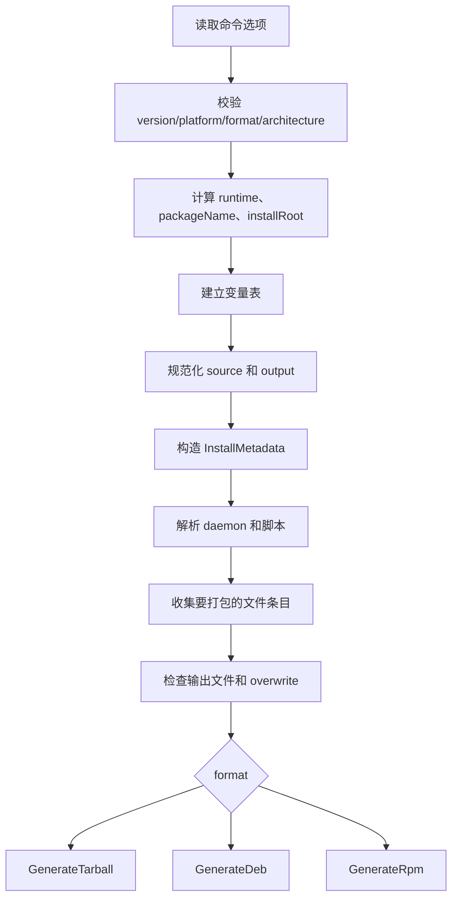

# Packager.Install.cs 实现说明

本文档解释 `Packager.Install.cs` 的实现原理，以及它生成 `.tar.gz`、`.deb`、`.rpm` 安装包时涉及的基础概念和技术细节。

适用源码：

- `Packager.Install.cs`
- `Program.cs` 中注册的 `Packager.InstallCommand`

## 1. 这个 install 命令解决什么问题

原来的 `pack` 命令更像是“发布升级包”：

- 把指定源目录或文件打成 `.zip`；
- 同时生成升级清单文件；
- 供 Zongsoft Upgrading 体系使用。

新的 `install` 命令更像是“安装包制作器”：

- 可以生成普通压缩安装包 `.tar.gz`；
- 可以生成 Debian 系发行版使用的 `.deb` 包；
- 可以生成 RedHat 系发行版使用的 `.rpm` 包；
- 可以携带安装前、安装后、卸载前、卸载后的脚本；
- 如果指定 `--daemon`，还能自动生成 Linux systemd 服务相关脚本。

命令大致形态：

```shell
dotnet-pack install --name:MyApp --version:1.0.0 --platform:linux --framework:net10.0 --format:Deb ./publish
```

最终输出类似：

```text
MyApp@1.0.0_linux-x64.deb
```

如果有 `--edition stable`，输出类似：

```text
MyApp(stable)@1.0.0_linux-x64.deb
```

## 2. 几个安装包格式的基础概念

### 2.1 tar 是什么

`tar` 是 Unix/Linux 世界里非常古老、非常基础的归档格式。

它本身主要负责“把很多文件顺序打包到一个文件里”，类似：

```text
file1
file2
dir/file3
...
```

但是 `tar` 本身通常不负责压缩。

所以常见的 `.tar.gz` 实际上是两层：

```text
.tar.gz
  = gzip 压缩
    + tar 归档
      + 很多文件
```

也就是说：

- `.tar`：只归档，不压缩；
- `.gz`：gzip 压缩；
- `.tar.gz`：先 tar 归档，再 gzip 压缩。

代码里用到：

- `System.Formats.Tar.TarWriter`
- `System.Formats.Tar.PaxTarEntry`
- `System.IO.Compression.GZipStream`

### 2.2 .deb 是什么

`.deb` 是 Debian、Ubuntu 等系统使用的软件包格式。

一个 `.deb` 文件本质上是一个 `ar` 归档文件。它里面通常包含三个成员：

```text
debian-binary
control.tar.gz
data.tar.gz
```

含义如下：

| 成员 | 作用 |
|---|---|
| `debian-binary` | 文本文件，内容通常是 `2.0\n`，表示 deb 包格式版本 |
| `control.tar.gz` | 控制信息，里面放包名、版本、描述、安装脚本等 |
| `data.tar.gz` | 真正要安装到系统里的文件 |

所以 `.deb` 也是多层结构：

```text
.deb
  = ar 归档
    + debian-binary
    + control.tar.gz
      + control
      + preinst
      + postinst
      + prerm
      + postrm
    + data.tar.gz
      + usr/local/myapp/...
```

安装 `.deb` 时，系统包管理器会：

1. 读取 `control` 元数据；
2. 执行安装前脚本 `preinst`；
3. 解压 `data.tar.gz` 到系统根目录 `/`；
4. 执行安装后脚本 `postinst`；
5. 卸载时执行 `prerm` 和 `postrm`。

### 2.3 .rpm 是什么

`.rpm` 是 Red Hat、Fedora、CentOS、Rocky Linux、openSUSE 等系统使用的软件包格式。

RPM 比 `.deb` 更复杂，它不是简单的 `ar` 包。一个典型 RPM 文件由几部分组成：

```text
.rpm
  + Lead
  + Signature Header
  + Main Header
  + Payload
```

含义如下：

| 部分 | 作用 |
|---|---|
| `Lead` | 早期 RPM 遗留头部，固定 96 字节 |
| `Signature Header` | 包体摘要、大小等签名相关信息 |
| `Main Header` | 包名、版本、架构、脚本、文件列表等元数据 |
| `Payload` | 真正的文件内容，常见格式是 `cpio.gz` |

当前实现使用的 RPM payload 是：

```text
gzip 压缩的新 ASCII CPIO(newc) 归档
```

也就是：

```text
Payload
  = gzip
    + cpio newc
      + /usr/local/myapp/...
```

RPM 的难点不在压缩，而在 Header：

- Header 由很多 tag 组成；
- 每个 tag 有类型、偏移、数量；
- 数字要按大端序写入；
- 不同 tag 表示包名、版本、文件大小、文件路径、脚本等。

`Packager.Install.cs` 里有一个 `RpmHeaderBuilder` 专门负责写这些 tag。

### 2.4 systemd 服务是什么

systemd 是现代 Linux 常见的服务管理系统。

一个服务通常由 `.service` 文件描述，例如：

```ini
[Unit]
Description=My Service

[Service]
ExecStart=/usr/local/myapp/MyApp

[Install]
WantedBy=multi-user.target
```

安装服务时常见动作：

```shell
systemctl stop xxx.service
ln -s /usr/local/myapp/xxx.service /etc/systemd/system/xxx.service
systemctl daemon-reload
systemctl enable xxx.service
```

卸载时常见动作：

```shell
systemctl stop xxx.service
rm -f /etc/systemd/system/xxx.service
systemctl daemon-reload
rm -rf /usr/local/myapp
```

`--daemon` 选项就是为这个场景准备的。

## 3. InstallCommand 的整体执行流程

`InstallCommand` 是一个 `CommandBase<CommandContext>`，结构参考了 `Packager.Pack.cs` 的 `PackCommand`。

它的主流程在 `OnExecuteAsync` 中，步骤如下：



核心代码关系：

| 方法/类型 | 作用 |
|---|---|
| `OnExecuteAsync` | 命令入口，协调整个打包流程 |
| `GetVariables` | 生成变量替换表 |
| `GetOutputPath` | 推导输出文件路径 |
| `GetEntries` | 收集要写入安装包的文件 |
| `GetScripts` | 合成安装/卸载脚本 |
| `GenerateTarball` | 生成 `.tar.gz` |
| `GenerateDeb` | 生成 `.deb` |
| `GenerateRpm` | 生成 `.rpm` |
| `InstallEntry` | 一个待安装文件的内部描述 |
| `InstallMetadata` | 安装包元数据 |
| `InstallScripts` | 四个生命周期脚本 |

## 4. 命令选项如何映射到代码

类开头的 `CommandOption` 属性定义了命令支持的选项：

```csharp
[CommandOption(NAME_OPTION, typeof(string), Required = true)]
[CommandOption(VERSION_OPTION, typeof(Version), Required = true)]
[CommandOption(PLATFORM_OPTION, typeof(Platform), Required = true)]
[CommandOption(FRAMEWORK_OPTION, typeof(string), Required = true)]
[CommandOption(SOURCE_OPTION, typeof(string))]
[CommandOption(FORMAT_OPTION, typeof(InstallFormat), InstallFormat.Tarball)]
...
```

几个关键点：

- `--name`、`--version`、`--platform`、`--framework` 是必填；
- `--format` 默认是 `Tarball`；
- `--architecture` 默认是 `x64`；
- `--source` 不指定时使用当前目录；
- `--output` 不指定时自动生成文件名；
- `--overwrite` 为 true 时允许覆盖已有输出文件；
- `--script.*` 选项指向脚本文件；
- `--daemon` 指向 systemd `.service` 文件。

`format` 对应的枚举是：

```csharp
public enum InstallFormat
{
    Tarball,
    Deb,
    Rpm,
}
```

## 5. 变量替换机制

`install` 命令复用了项目里已有的 `Normalizer.Normalize` 机制。

支持类似：

```text
$(Runtime)
$(RuntimeIdentifier)
$(Architecture)
$(InstallRoot)
%PATH%
```

变量来源：

1. 系统环境变量；
2. 命令选项；
3. install 命令额外添加的变量。

额外变量包括：

| 变量 | 示例 | 说明 |
|---|---|---|
| `Runtime` | `linux-x64` | 平台和 CPU 架构组合 |
| `RuntimeIdentifier` | `linux-x64` | 与 `Runtime` 相同 |
| `Architecture` | `x64` | CPU 架构 |
| `InstallRoot` | `/usr/local/myapp` | Linux 包内默认安装根目录 |

例如：

```shell
--output ./dist/$(Runtime)/
```

可能会被规范化成：

```text
./dist/linux-x64/
```

## 6. 平台、架构和 runtime 的处理

用户输入的架构是字符串：

```text
x64
x32
arm64
arm32
```

代码用 `GetArchitecture` 转成内部 `Architecture` 枚举：

| 用户输入 | 内部架构 |
|---|---|
| `x64`, `amd64` | `Architecture.X64` |
| `x32`, `x86`, `i386` | `Architecture.X86` |
| `arm64`, `aarch64` | `Architecture.Arm64` |
| `arm32`, `arm`, `armhf` | `Architecture.Arm32` |

然后通过：

```csharp
Application.GetRuntimeIdentifier(platform, architecture)
```

生成 runtime：

| platform | architecture | runtime |
|---|---|---|
| `windows` | `x64` | `win-x64` |
| `linux` | `x64` | `linux-x64` |
| `linux` | `arm64` | `linux-arm64` |

这个 runtime 会参与默认输出文件名。

## 7. 包名、安装目录和输出文件名

### 7.1 安装包显示文件名

用户看到的输出文件名由 `GetFileName` 生成：

```text
未指定 edition:
{name}@{version}_{runtime}

指定 edition:
{name}({edition})@{version}_{runtime}
```

再加上格式扩展名：

| format | 扩展名 |
|---|---|
| `Tarball` | `.tar.gz` |
| `Deb` | `.deb` |
| `Rpm` | `.rpm` |

例如：

```text
Zongsoft.Daemon@1.1.0_linux-x64.tar.gz
Zongsoft.Daemon(stable)@1.1.0_linux-x64.deb
```

### 7.2 Linux 包内部 packageName

`.deb` 和 `.rpm` 的内部包名一般要求更接近 Linux 生态习惯：

- 小写；
- 尽量只含字母、数字、点、加号、连字符；
- 空格、括号等不适合直接放进去。

所以代码使用 `GetPackageName` 把 `name` 和 `edition` 规范化：

```text
Zongsoft.Daemon + stable
=> zongsoft.daemon-stable
```

### 7.3 默认安装目录

代码里定义了：

```csharp
private const string DEFAULT_INSTALL_ROOT = "/usr/local";
```

最终安装根目录是：

```text
/usr/local/{packageName}
```

例如：

```text
/usr/local/zongsoft.daemon
/usr/local/zongsoft.daemon-stable
```

对于 `.deb` 和 `.rpm`，包内文件会加上这个前缀。

例如源目录里有：

```text
app.dll
appsettings.json
daemon.service
```

打进 `.deb` 或 `.rpm` 后路径大致是：

```text
usr/local/zongsoft.daemon/app.dll
usr/local/zongsoft.daemon/appsettings.json
usr/local/zongsoft.daemon/daemon.service
```

因为 Linux 包安装时会把这些相对路径解压到系统根目录 `/`，最终落到：

```text
/usr/local/zongsoft.daemon/app.dll
/usr/local/zongsoft.daemon/appsettings.json
/usr/local/zongsoft.daemon/daemon.service
```

对于普通 `Tarball`，代码不加 `/usr/local/...` 前缀，保持相对路径，便于用户自己解压。

## 8. 文件条目收集逻辑

`GetEntries` 负责把用户指定的源文件变成内部 `InstallEntry` 列表。

`InstallEntry` 包含：

```csharp
readonly record struct InstallEntry(
    string Source,
    string EntryName,
    long Size,
    long ModifiedTime,
    int Mode);
```

字段含义：

| 字段 | 说明 |
|---|---|
| `Source` | 本机真实文件路径 |
| `EntryName` | 包里的相对路径 |
| `Size` | 文件大小 |
| `ModifiedTime` | Unix 时间戳 |
| `Mode` | Unix 文件权限，如 `0644`、`0755` |

### 8.1 没有指定源文件参数

如果命令最后没有传文件参数：

```shell
dotnet-pack install --source ./publish ...
```

则递归收集 `--source` 目录下所有文件。

### 8.2 指定源文件参数

如果传了参数：

```shell
dotnet-pack install ./app.dll ./appsettings.json ...
```

则只打包这些文件。

也支持通配符：

```shell
dotnet-pack install "./*.dll" "./*.json" ...
```

也支持类似 `PackCommand` 的别名语法：

```shell
dotnet-pack install "C:\temp\app.dll:bin/app.dll" ...
```

左侧是真实文件，右侧是包内路径。

### 8.3 Windows 盘符特殊处理

Windows 路径里有盘符：

```text
C:\temp\app.dll
```

这个冒号不能被误判为别名分隔符。

所以代码里判断：

```csharp
if(OperatingSystem.IsWindows() && index == 1)
    index = -1;
```

如果冒号在第 1 位，说明大概率是 `C:` 这样的盘符。

### 8.4 文件权限

Linux 包需要记录文件权限。

代码的策略：

- 如果当前运行系统不是 Windows，优先读取真实 Unix 权限；
- 如果是 Windows，则按扩展名猜测；
- `.sh`、`.dll`、`.exe` 或无扩展名，默认 `0755`；
- 其它文件默认 `0644`。

含义：

| 权限 | 含义 |
|---|---|
| `0644` | 所有人可读，只有所有者可写，不可执行 |
| `0755` | 所有人可读可执行，只有所有者可写 |

## 9. 脚本系统

安装包支持四个生命周期脚本：

| 命令选项 | 内部字段 | Debian 脚本名 | RPM tag |
|---|---|---|---|
| `--script.installing` | `Installing` | `preinst` | `1023` |
| `--script.installed` | `Installed` | `postinst` | `1024` |
| `--script.uninstalling` | `Uninstalling` | `prerm` | `1025` |
| `--script.uninstalled` | `Uninstalled` | `postrm` | `1026` |

`ReadScript` 会把选项值当成脚本文件路径读取。

例如：

```shell
--script.installed ./scripts/post-install.sh
```

代码会读取该文件内容，然后嵌入安装包。

脚本最终会被包装成：

```shell
#!/bin/sh
set -e
...
```

`set -e` 的含义是：脚本中命令失败时立即退出。

## 10. daemon/systemd 自动脚本

如果指定：

```shell
--daemon ./myapp.service
```

代码会做几件事。

### 10.1 确认 service 文件存在

`GetDaemonPath` 会：

1. 对路径做变量替换；
2. 相对路径转换为基于 `--source` 的路径；
3. 检查文件是否存在；
4. 返回完整路径。

### 10.2 自动把 service 文件加入包

即使用户只指定了部分源文件，只要给了 `--daemon`，代码也会把这个 `.service` 文件加入安装包。

这样安装后的符号链接才不会指向不存在的文件。

### 10.3 生成安装/卸载脚本

安装前：

```shell
systemctl stop 'xxx.service' >/dev/null 2>&1 || true
```

安装后：

```shell
install -d /etc/systemd/system
ln -sfn '/usr/local/package/xxx.service' '/etc/systemd/system/xxx.service'
systemctl daemon-reload >/dev/null 2>&1 || true
systemctl enable 'xxx.service' >/dev/null 2>&1 || true
```

卸载前：

```shell
systemctl stop 'xxx.service' >/dev/null 2>&1 || true
```

卸载后：

```shell
rm -f '/etc/systemd/system/xxx.service'
systemctl daemon-reload >/dev/null 2>&1 || true
rm -rf '/usr/local/package'
```

这些自动脚本会和用户通过 `--script.*` 指定的脚本合并。

合并顺序是：

```text
自动 daemon 脚本
然后用户脚本
```

## 11. Tarball 生成细节

入口方法：

```csharp
GenerateTarball(output, entries, scripts)
```

实现结构：

```csharp
using var stream = File.Create(output);
using var gzip = new GZipStream(stream, CompressionLevel.Optimal);
using var writer = new TarWriter(gzip, TarEntryFormat.Pax, false);
```

这说明输出文件结构是：

```text
FileStream
  <- GZipStream
     <- TarWriter
```

也就是先写 tar，再由 gzip 压缩到最终文件。

### 11.1 PAX tar 格式

代码使用：

```csharp
TarEntryFormat.Pax
```

PAX 是 POSIX tar 的扩展格式，优点是：

- 支持更长路径；
- 支持更丰富元数据；
- 比老式 ustar 更灵活。

### 11.2 tarball 中脚本放在哪里

普通 `.tar.gz` 没有像 `.deb`、`.rpm` 那样的标准安装生命周期。

所以代码把脚本作为普通文件放入：

```text
.install/installing.sh
.install/installed.sh
.install/uninstalling.sh
.install/uninstalled.sh
```

这不会自动执行，只是随包携带。

如果未来需要做 tarball 安装器，可以约定读取 `.install` 目录里的脚本。

## 12. Deb 生成细节

入口方法：

```csharp
GenerateDeb(output, metadata, entries, scripts)
```

生成过程：

```csharp
WriteArHeader(stream);
WriteArEntry(stream, "debian-binary", Encoding.ASCII.GetBytes("2.0\n"));
WriteArEntry(stream, "control.tar.gz", CreateControlTarball(control, scripts));
WriteArEntry(stream, "data.tar.gz", CreateDataTarball(entries));
```

也就是手工写一个 `ar` 文件。

### 12.1 ar 文件结构

`.deb` 外层是 `ar`。

`ar` 文件开头是固定魔数：

```text
!<arch>\n
```

每个成员前面有一个 60 字节左右的文本头，包含：

- 成员名；
- 时间戳；
- uid；
- gid；
- 权限；
- 数据长度。

代码里的 `WriteArEntry` 就是在写这个成员头。

如果成员长度是奇数，`ar` 需要补一个换行字节，让下一个成员对齐。

### 12.2 control.tar.gz

`CreateControlTarball` 写入：

```text
control
preinst
postinst
prerm
postrm
```

其中 `control` 由 `GetDebControl` 生成。

示例：

```text
Package: zongsoft.daemon
Version: 1.1.0
Section: utils
Priority: optional
Architecture: amd64
Installed-Size: 1024
Maintainer: Zongsoft Studio <zongsoft@qq.com>
Homepage: https://github.com/Zongsoft/framework
Description: Zongsoft daemon
 ...
```

架构映射：

| 内部架构 | Debian 架构 |
|---|---|
| `X64` | `amd64` |
| `X86` | `i386` |
| `Arm64` | `arm64` |
| `Arm32` | `armhf` |

### 12.3 data.tar.gz

`CreateDataTarball` 把 `InstallEntry` 列表写成 tar.gz。

因为 `.deb` 安装时会把 `data.tar.gz` 解到系统根目录，所以包内路径必须像：

```text
usr/local/zongsoft.daemon/app.dll
```

安装后就是：

```text
/usr/local/zongsoft.daemon/app.dll
```

## 13. RPM 生成细节

RPM 是这个文件里最复杂的一部分。

入口方法：

```csharp
GenerateRpm(output, metadata, entries, scripts)
```

流程：

```csharp
var payload = CreateCpioPayload(entries, out var archiveSize);
var header = RpmHeader.Create(metadata, entries, scripts, archiveSize);
var body = Combine(header, payload);
var signature = RpmSignature.Create(body);

WriteRpmLead(stream, metadata);
stream.Write(signature);
stream.Write(body);
```

最终结构：

```text
Lead
Signature Header
Main Header
Payload
```

### 13.1 RPM Lead

`WriteRpmLead` 写 96 字节固定头。

关键字节：

```text
ed ab ee db
```

这是 RPM 文件魔数。

Lead 中还写入：

- RPM 主版本；
- 包类型；
- CPU 架构编号；
- 包名；
- 操作系统类型。

现代 RPM 工具仍会识别这个部分，但真正重要的信息大多在 Header 中。

### 13.2 Signature Header

`RpmSignature.Create` 写了两个主要 tag：

| tag | 含义 |
|---|---|
| `257` | 包体大小 |
| `261` | MD5 摘要 |

这里的签名头是基础完整性信息，不是 GPG 签名。

如果未来要发布到严格仓库，通常还需要用 `rpmsign` 或类似工具做正式签名。

### 13.3 Main Header

`RpmHeader.Create` 写包的核心元数据。

常见 tag：

| tag | 含义 |
|---|---|
| `1000` | 包名 |
| `1001` | 版本 |
| `1002` | release |
| `1004` | summary |
| `1005` | description |
| `1006` | build time |
| `1009` | installed size |
| `1014` | license |
| `1015` | packager/vendor |
| `1021` | operating system |
| `1022` | architecture |
| `1023` | pre install script |
| `1024` | post install script |
| `1025` | pre uninstall script |
| `1026` | post uninstall script |
| `1035` | file digest |
| `1116` | file directory indexes |
| `1117` | file basenames |
| `1118` | directory names |
| `1124` | payload format |
| `1125` | payload compressor |
| `1126` | payload flags |

RPM 为了节省空间，不直接为每个文件存完整路径，而是拆成：

```text
dirname + basename
```

例如：

```text
/usr/local/myapp/app.dll
```

会拆成：

```text
dirname: /usr/local/myapp/
basename: app.dll
```

`1118` 存目录数组，`1117` 存文件名数组，`1116` 存每个文件对应哪个目录下标。

### 13.4 RpmHeaderBuilder 的作用

RPM Header 内部格式大致是：

```text
magic
reserved
index count
store size
index records...
store bytes...
padding
```

每个 index record 记录：

```text
tag
type
offset
count
```

真正的数据放在 store 区。

所以 `RpmHeaderBuilder` 做了两件事：

1. 把每个 tag 的数据写到 `_store`；
2. 同时记录 tag 在 `_store` 中的偏移、类型和数量。

数字写入使用：

```csharp
BinaryPrimitives.WriteInt16BigEndian
BinaryPrimitives.WriteInt32BigEndian
```

因为 RPM Header 要求大端序。

### 13.5 RPM Payload: cpio.gz

RPM 的文件内容由 `CreateCpioPayload` 生成。

当前实现使用的是 `newc` 格式 CPIO：

```text
070701...
```

每个 CPIO 条目包含：

- inode；
- mode；
- uid；
- gid；
- mtime；
- filesize；
- namesize；
- name；
- file data。

写完所有文件后，CPIO 需要一个特殊结束条目：

```text
TRAILER!!!
```

然后再按 512 字节补齐。

最后用 gzip 压缩，成为 RPM payload。

## 14. 三种格式的差异总结

| 格式 | 本质 | 是否有标准安装脚本 | 是否适合 Linux 包管理器 | 当前实现 |
|---|---|---|---|---|
| `.tar.gz` | gzip 压缩的 tar 文件 | 没有 | 不直接适合 | 文件 + `.install/*.sh` |
| `.deb` | ar 包，内含 control/data tarball | 有 | Debian/Ubuntu | 支持 control 和四个脚本 |
| `.rpm` | RPM 专用二进制结构 | 有 | RHEL/Fedora/openSUSE | 支持 header、脚本和 cpio.gz payload |

简单理解：

- `.tar.gz` 是“压缩包”；
- `.deb` 是 Debian 系“软件安装包”；
- `.rpm` 是 Red Hat 系“软件安装包”。

## 15. 和 Packager.Pack.cs 的关系

`Packager.Pack.cs` 的核心思路是：

1. 读取命令选项；
2. 规范化变量；
3. 解析源目录和输出路径；
4. 收集参数指定的文件；
5. 写包；
6. 输出成功信息。

`Packager.Install.cs` 复用了这个架构，但输出目标不同：

| 维度 | `pack` | `install` |
|---|---|---|
| 输出格式 | `.zip` | `.tar.gz`、`.deb`、`.rpm` |
| 是否生成清单 | 是 | 否 |
| 是否支持安装脚本 | 通过 executor 思路 | 直接内嵌安装/卸载脚本 |
| 是否面向系统包管理器 | 否 | 是 |
| 文件路径语义 | 包内相对路径 | Linux 包中映射到 `/usr/local/{package}` |

## 16. 当前实现的边界和注意事项

### 16.1 RPM 没有 GPG 签名

当前 `RpmSignature` 只写基础摘要信息，不做 GPG 签名。

如果要放进正式 RPM 仓库，建议后续增加：

```shell
rpmsign --addsign xxx.rpm
```

或者在工具里集成签名能力。

### 16.2 RPM 是最小可用实现

RPM 格式历史很长，不同发行版和 rpm 版本对 tag、payload、摘要算法的兼容性可能有差异。

当前实现的目标是直接生成一个结构合理、包含基础元数据和 payload 的 RPM，但仍建议用实际工具验证：

```shell
rpm -Kv xxx.rpm
rpm -qip xxx.rpm
rpm -qlp xxx.rpm
sudo rpm -i xxx.rpm
```

### 16.3 Deb 也建议用 dpkg 验证

建议验证：

```shell
dpkg-deb --info xxx.deb
dpkg-deb --contents xxx.deb
sudo dpkg -i xxx.deb
sudo dpkg -r package-name
```

### 16.4 tarball 不会自动执行脚本

`.tar.gz` 只是压缩包，不是系统安装包。

里面的 `.install/*.sh` 只是被打进去，不会被自动执行。

### 16.5 默认安装目录固定在 /usr/local

当前实现固定：

```text
/usr/local/{packageName}
```

如果后续需要更灵活，可以增加选项：

```shell
--install-root /opt/apps
```

### 16.6 卸载后脚本会删除安装目录

如果指定了 `--daemon`，卸载后脚本包含：

```shell
rm -rf '/usr/local/{packageName}'
```

这符合“卸载服务并删除安装目录”的需求，但生产环境要注意：

- 该目录里不要放用户运行时数据；
- 日志和数据最好放到 `/var/log`、`/var/lib` 等目录；
- 否则卸载会一起删除。

## 17. 一个具体例子

假设源目录：

```text
publish/
  Zongsoft.Daemon.dll
  appsettings.json
  zongsoft-daemon.service
```

执行：

```shell
dotnet-pack install \
  --name Zongsoft.Daemon \
  --version 1.1.0 \
  --platform linux \
  --framework net10.0 \
  --format Deb \
  --edition stable \
  --source ./publish \
  --daemon ./zongsoft-daemon.service \
  --overwrite
```

输出文件：

```text
Zongsoft.Daemon(stable)@1.1.0_linux-x64.deb
```

内部包名：

```text
zongsoft.daemon-stable
```

安装路径：

```text
/usr/local/zongsoft.daemon-stable/
```

`.deb` 内部大致结构：

```text
debian-binary
control.tar.gz
  control
  preinst
  postinst
  prerm
  postrm
data.tar.gz
  usr/local/zongsoft.daemon-stable/Zongsoft.Daemon.dll
  usr/local/zongsoft.daemon-stable/appsettings.json
  usr/local/zongsoft.daemon-stable/zongsoft-daemon.service
```

安装后脚本会创建：

```text
/etc/systemd/system/zongsoft-daemon.service
  -> /usr/local/zongsoft.daemon-stable/zongsoft-daemon.service
```

并执行：

```shell
systemctl daemon-reload
systemctl enable zongsoft-daemon.service
```

## 18. 后续可以改进的方向

可以考虑增加以下能力：

1. 增加 `--install-root`，让安装目录从 `/usr/local` 改为可配置。
2. 增加 `--maintainer`、`--license`、`--url`、`--category` 等元数据选项。
3. 给 `.deb` 增加依赖字段，例如 `Depends`。
4. 给 `.rpm` 增加更完整的 dependency/provides/conflicts 元数据。
5. 给 `.rpm` 支持正式签名。
6. 给 `.tar.gz` 生成一个顶层 `install.sh`，方便手工安装。
7. 增加针对 `.deb` 和 `.rpm` 的自动验证命令封装。

## 19. 简短结论

`Packager.Install.cs` 的核心思想是：

1. 把命令选项变成统一的元数据 `InstallMetadata`；
2. 把源目录或指定源文件变成统一的文件条目 `InstallEntry`；
3. 把用户脚本和 daemon 自动脚本合成为 `InstallScripts`；
4. 根据目标格式，把同一组条目和脚本写成不同安装包结构。

三种格式的本质区别是：

- `Tarball`：直接写 `tar.gz`，最简单，脚本只随包携带；
- `Deb`：写 `ar + control.tar.gz + data.tar.gz`，由 Debian 包管理器执行脚本；
- `Rpm`：写 `Lead + Signature Header + Main Header + cpio.gz Payload`，由 RPM 包管理器执行脚本。

这就是整个实现的主线。
