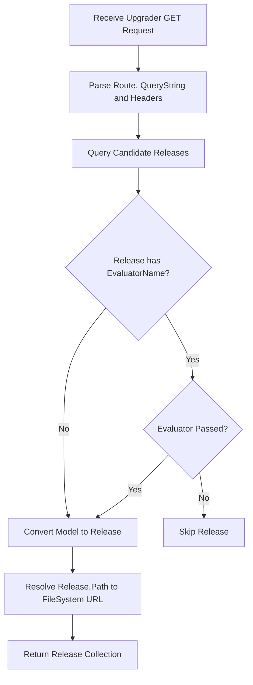

# 数据模型设计

## 数据库原则

1. 支持 MySQL、PostgreSQL 和 SQLite。
2. 数据库物理表名采用 `Upgrading_` 前缀，实体类名保持单数形式。
3. API 路径资源名采用复数形式。
4. Release 元数据入库，发布包 `.zip` 不进入数据库。
5. 发布包通过 `Zongsoft.IO` 虚拟文件系统保存，当前 Web 默认存储根路径为 `zfs.s3:/upgrading/releases`。
6. Release 的扩展属性、执行器和发布状态使用主从表。

## Application

Application 表表示应用定义。系统会在创建 Release 或导入 `.manifest` 时根据发布信息自动维护该表，也提供 API 供手动维护。

字段：

| 字段 | 说明 |
| --- | --- |
| ApplicationId | 应用编号，主键 |
| Name | 应用名称，唯一 |
| Title | 应用标题 |
| Enabled | 是否启用 |
| Creation | 创建时间 |
| Modification | 修改时间 |
| Description | 描述信息 |

说明：

- 是否需要 License 授权由 ApplicationEdition 的 `Licensed` 字段表达。
- `Name` 建立唯一索引。

## ApplicationEdition

ApplicationEdition 是 Application 的子表，表示某个应用的版本名配置。系统会在创建 Release 或导入 `.manifest` 时根据发布信息自动维护该表，也提供 API 供手动维护。

对应 API 采用子资源路径：`/Upgrading/Applications/{applicationId}/Editions`。

字段：

| 字段 | 说明 |
| --- | --- |
| ApplicationId | 关联 Application，主键 |
| Name | Edition 名称，主键 |
| Title | 版本标题 |
| Enabled | 是否启用 |
| Licensed | 是否授权 |
| Creation | 创建时间 |
| Modification | 修改时间 |
| Description | 描述信息 |

主键：

```text
ApplicationId + Name
```

## Release

Release 表表示发布元数据。

字段：

| 字段 | 说明 |
| --- | --- |
| ReleaseId | 发布编号，主键 |
| Name | 应用名称 |
| Edition | 版本名，默认空字符串 |
| Version | 版本号 |
| Kind | 发布类型，`0` 表示 Fully，`1` 表示 Delta |
| Mode | 升级部署模式，`0` 表示 Default，`1` 表示 Immediate |
| Platform | 平台 |
| Architecture | 架构 |
| Path | `Zongsoft.IO` 虚拟文件系统文件地址 |
| Size | 包大小 |
| Checksum | 校验码 |
| Tags | 标签集 |
| Deprecated | 是否废弃 |
| Published | 是否已发布 |
| Visible | 是否可见 |
| Title | 发布标题 |
| Summary | 发布摘要 |
| EvaluatorName | 评估器名称 |
| EvaluatorSetting | 评估器设置 |
| Creation | 创建时间 |
| Modification | 修改时间 |
| Description | 描述信息 |

唯一索引：

```text
Name + Edition + Version + Platform + Architecture
```

`Mode` 值：

- `Default`：默认模式，在客户端程序重启时进行升级部署。
- `Immediate`：尽快执行升级部署，不等待下次程序重启。

查询可升级候选发布时，当前至少满足：

- `Published = true`
- `Visible = true`
- `Deprecated = false`
- `Name`、`Edition`、`Platform`、`Architecture` 与请求匹配
- 如果指定了 `EvaluatorName`，对应评估器必须评估通过

## ReleaseProperty

ReleaseProperty 表示 Release 的扩展属性。

字段：

| 字段 | 说明 |
| --- | --- |
| ReleaseId | 关联 Release，主键 |
| Name | 属性名，主键 |
| Type | 属性类型 |
| Value | 属性值 |

主键：

```text
ReleaseId + Name
```

约定属性：

- `Download.Url`：可选的升级包下载地址。

## ReleaseExecutor

ReleaseExecutor 表示 Release 的执行器。

字段：

| 字段 | 说明 |
| --- | --- |
| ReleaseId | 关联 Release，主键 |
| SerialId | 执行器序号，主键 |
| Event | 执行事件 |
| Command | 执行命令 |

主键：

```text
ReleaseId + SerialId
```

## Instance

Instance 表示安装了应用的客户端实例。

字段：

| 字段 | 说明 |
| --- | --- |
| InstanceId | 实例编号，主键 |
| InstanceCode | 实例代号，唯一 |
| Name | 实例名称 |
| Tags | 标签集 |
| Profile | 配置信息，包含硬件、操作系统等 |
| Creation | 创建时间 |
| Modification | 修改时间 |
| Description | 描述说明 |

唯一索引：

```text
InstanceCode
```

## ReleasePublishing

ReleasePublishing 表示某个发布在某个实例上的升级发布状态。

对应 API 可从发布维度访问 `/Upgrading/Releases/{releaseId}/Publishings`，也可从实例维度访问 `/Upgrading/Instances/{instanceId}/Publishings`。

字段：

| 字段 | 说明 |
| --- | --- |
| ReleaseId | 发布编号，主键 |
| InstanceId | 实例编号，主键 |
| Status | 发布状态 |
| Message | 失败消息 |
| Timestamp | 更新时间 |
| Description | 更新描述 |

主键：

```text
ReleaseId + InstanceId
```

`Status` 值：

- `Fetch`
- `Downloading`
- `Downloaded`
- `Upgrading`
- `Upgraded`
- `Completed`

## 升级获取流程


