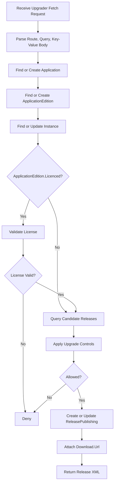

# 数据模型设计

## 数据库原则

1. 支持 MySQL 和 SQLite。
2. 数据库表名称与实体类名称一致，采用单数形式。
3. API 路径资源名采用复数形式。
4. Release 元数据入库，字段尽量贴合 `Release` 类。
5. 发布包 `.zip` 不进入数据库，通过 `Zongsoft.IO` 虚拟文件系统保存到 S3。
6. Release 的扩展属性和执行器使用主从表。

## Application

Application 表表示应用定义。系统会在创建 Release 时根据发布信息自动维护该表，也提供 API 供手动维护。

建议字段：

| 字段 | 说明 |
| --- | --- |
| ApplicationId | 应用编号，主键 |
| Name | 应用名称 |
| Title | 应用标题 |
| Description | 描述 |
| Enabled | 是否启用 |
| Creation | 创建时间 |
| Modification | 修改时间 |

说明：

- 是否需要 License 授权由 ApplicationEdition 的 `Licenced` 字段表达。

## ApplicationEdition

ApplicationEdition 是 Application 的子表，表示某个应用的版本名配置。系统会在创建 Release 时根据发布信息自动维护该表，也提供 API 供手动维护。

对应 API 采用子资源路径：`/upgrading/applications/editions`。

建议字段：

| 字段 | 说明 |
| --- | --- |
| ApplicationId | 关联 Application，主键 |
| Name | Edition 名称，主键 |
| Title | 标题 |
| Description | 描述 |
| Licenced | 是否需要 License 授权 |
| Enabled | 是否启用 |
| Creation | 创建时间 |
| Modification | 修改时间 |

主键：

```text
ApplicationId + Name
```

> 字段名 `Licenced` 按当前需求描述保留，最终拼写可在实现前再确认。

## Release

Release 表表示发布元数据。

建议字段：

| 字段 | 说明 |
| --- | --- |
| Id | 主键 |
| ApplicationId | 关联 Application |
| Name | 应用名称 |
| Edition | 版本名 |
| Version | 版本号 |
| Kind | `Fully` 或 `Delta` |
| Mode | 升级部署模式 |
| Platform | 平台 |
| Architecture | 架构 |
| Path | `Zongsoft.IO` 虚拟文件系统完整文件路径 |
| Size | 包大小 |
| Checksum | 校验码 |
| Title | 标题 |
| Summary | 摘要 |
| Description | 描述 |
| Tags | 标签，可用文本或独立标签表，第一版可先用文本 |
| FilterName | 过滤器名称 |
| FilterData | 过滤器数据 |
| FilterSetting | 过滤器设置 |
| Deprecated | 是否废弃 |
| Published | 是否已发布 |
| Visible | 是否可见 |
| Creation | 创建时间 |
| Modification | 修改时间 |

唯一索引：

```text
Name + Edition + Version + Platform + Architecture
```

`Mode` 建议值：

- `Default`：默认模式，在客户端程序重启时进行升级部署。
- `Immediate`：尽快执行升级部署，不等待下次程序重启。

查询可升级候选发布时，至少应满足：

- `Published = true`
- `Visible = true`
- `Deprecated = false`
- 版本大于当前版本
- 版本小于等于指定目标版本，若指定了目标版本

## ReleaseProperty

ReleaseProperty 表示 Release 的扩展属性。

建议字段：

| 字段 | 说明 |
| --- | --- |
| ReleaseId | 关联 Release |
| Name | 属性名 |
| Type | 属性类型 |
| Value | 属性值 |

主键：

```text
ReleaseId + Name
```

约定属性：

- `Download.Url`：升级包下载地址，通常为可访问的 S3 存储对象公共地址。

## ReleaseExecutor

ReleaseExecutor 表示 Release 的执行器。

建议字段：

| 字段 | 说明 |
| --- | --- |
| ReleaseId | 关联 Release |
| SerialId | 执行器序号 |
| Event | 执行事件 |
| Command | 执行命令 |

主键：

```text
ReleaseId + SerialId
```

## Instance

Instance 表示安装了应用的客户端实例。

建议字段：

| 字段 | 说明 |
| --- | --- |
| InstanceId | 实例编号，主键 |
| InstanceCode | 客户端机器唯一编号，唯一索引 |
| Name | 实例名称 |
| Tags | 标签集 |
| Profile | 配置信息，包含硬件、操作系统等，建议 JSON 或文本 |
| Creation | 创建时间 |
| Modification | 修改时间 |
| Description | 描述说明 |

唯一索引：

```text
InstanceCode
```

## ReleasePublishing

ReleasePublishing 表示某个发布在某个实例上的升级发布状态。

对应 API 采用子资源路径：`/upgrading/releases/publishings`。

建议字段：

| 字段 | 说明 |
| --- | --- |
| ReleaseId | 发布编号，主键 |
| InstanceId | 实例编号，主键 |
| Status | 发布状态 |
| Message | 失败消息 |
| Timestamp | 更新时间 |
| Description | 更新描述 |

主键：

```text
ReleaseId + InstanceId
```

`Status` 建议值：

- `Fetch`
- `Downloading`
- `Downloaded`
- `Upgrading`
- `Upgraded`
- `Completed`

## 决策流程



